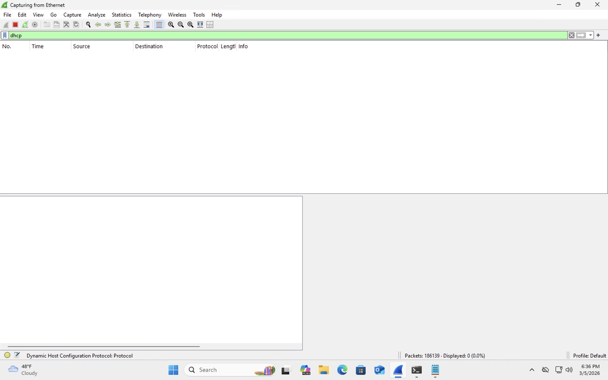
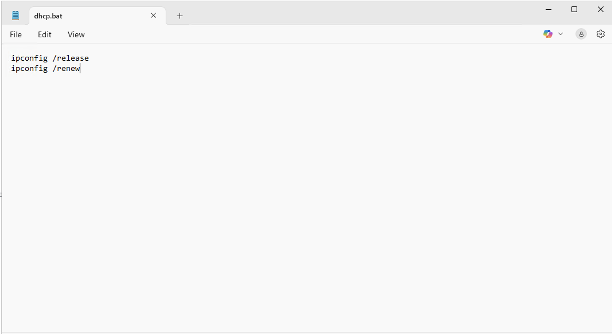
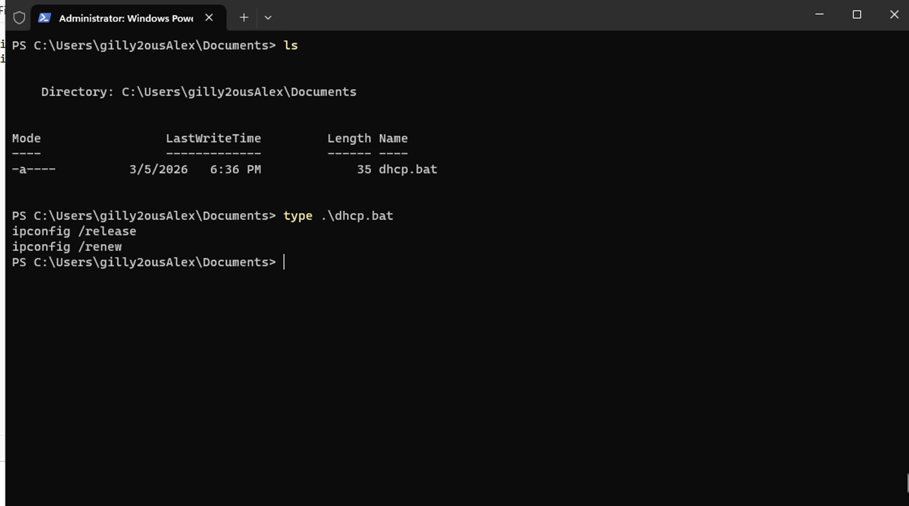
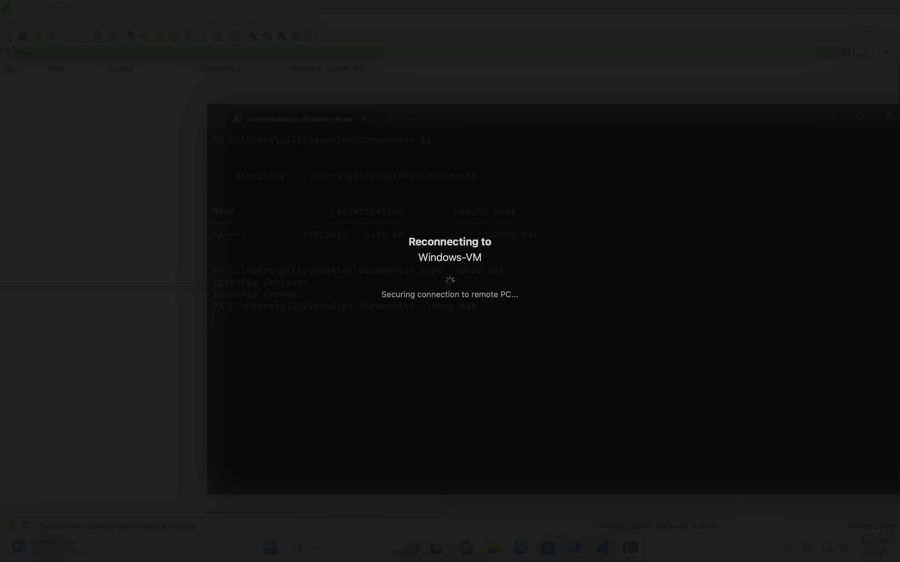
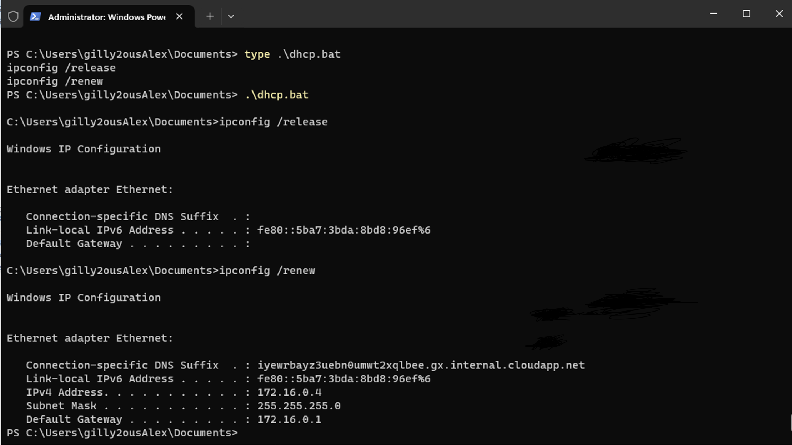
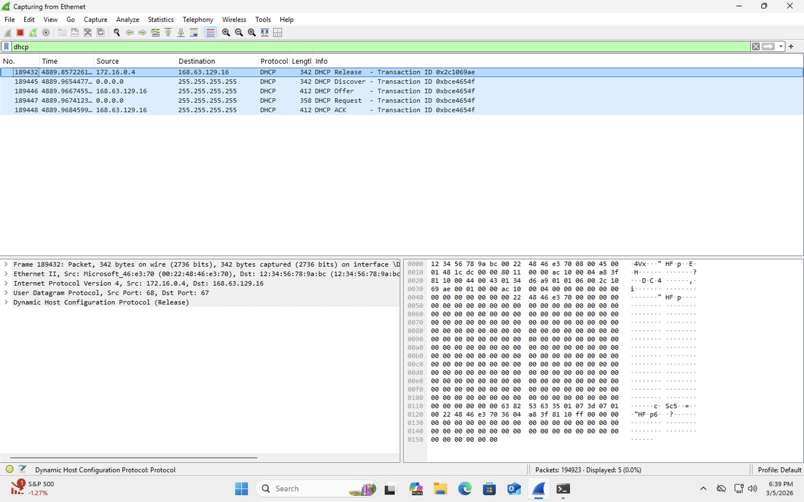
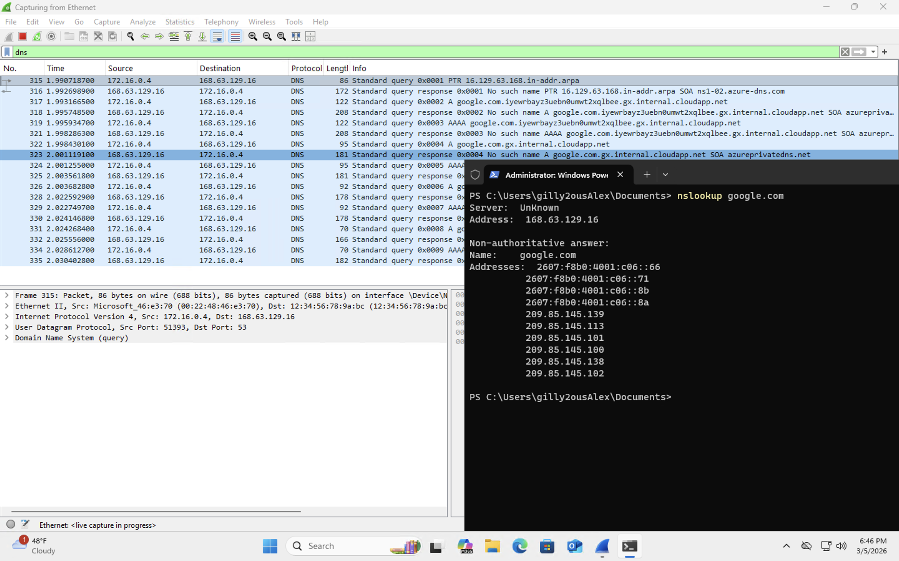
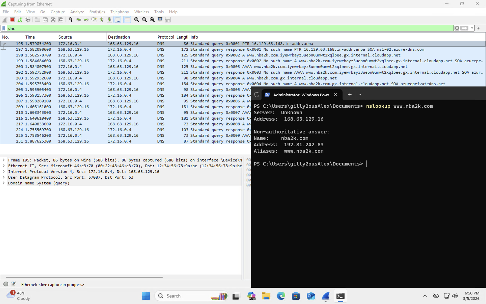

<h2>Analyzing DHCP Traffic in Wireshark</h2>

In this section of the lab, we will analyze <b>DHCP (Dynamic Host Configuration Protocol)</b> traffic using Wireshark.

DHCP is a network protocol responsible for automatically assigning IP addresses to devices when they connect to a network. Without DHCP, network administrators would need to manually configure IP addresses on every device, which would be extremely inefficient in most environments.

When a device joins a network, DHCP performs a process known as the <b>DORA process</b>:

<ul>
<li><b>Discover</b> – The device broadcasts a request asking for an available IP address.</li>
<li><b>Offer</b> – The DHCP server responds with an available IP address.</li>
<li><b>Request</b> – The device requests the offered IP address.</li>
<li><b>Acknowledge</b> – The DHCP server confirms the assignment.</li>
</ul>

This process happens very quickly and usually occurs automatically when a device connects to a network.

In this lab, we will manually trigger DHCP activity so we can capture and analyze the packets in Wireshark.

---

<h3>Applying a DHCP Filter in Wireshark</h3>

To focus only on DHCP-related traffic, we apply a display filter in Wireshark.

The filter used is:

<b>dhcp</b>

This filter instructs Wireshark to display only DHCP packets, hiding other types of network traffic so the analysis is easier to follow.

---

<h3>Generating DHCP Traffic</h3>

To generate DHCP activity, we will release and renew the IP address of the Windows virtual machine.

This forces the system to request a new IP address from the DHCP server.

The following commands are used:

The commands inside the script are:

<ul>
<li><b>ipconfig /release</b> – Releases the current IP address.</li>
<li><b>ipconfig /renew</b> – Requests a new IP address from the DHCP server.</li>
</ul>

---

<h3>Executing the DHCP Script</h3>

After creating the script, it can be executed from PowerShell.

When the script runs, the system first releases its current IP address and then immediately requests a new one from the DHCP server.

This action generates DHCP traffic that Wireshark can capture.

---

<h3>DHCP Lease Process</h3>

After running the commands, the system receives a new network configuration.

The system is assigned a new IPv4 address along with additional network configuration information such as:

<ul>
<li>Subnet Mask</li>
<li>Default Gateway</li>
<li>DNS Server</li>
</ul>

These values allow the system to properly communicate with other devices and access the internet.

---

<h3>Captured DHCP Traffic</h3>

Now we can return to Wireshark to examine the packets that were generated during the DHCP process.

Several DHCP packets appear in the capture results. These packets represent the communication between the client machine and the DHCP server.

---

<h3>Understanding the DHCP Packet Sequence</h3>

Looking closely at the captured packets, we can see the steps of the DHCP process.

The packets captured include:

<ul>
<li><b>DHCP Release</b> – The client releases its previous IP address.</li>
<li><b>DHCP Discover</b> – The client broadcasts a request for a new IP address.</li>
<li><b>DHCP Offer</b> – The DHCP server offers an available IP address.</li>
<li><b>DHCP Request</b> – The client requests the offered IP address.</li>
<li><b>DHCP ACK</b> – The server confirms the assignment.</li>
</ul>

These packets represent the complete DHCP handshake that allows devices to automatically join a network and obtain the configuration necessary for communication.

By analyzing these packets in Wireshark, network administrators and security analysts can observe how devices obtain network configurations and troubleshoot issues related to IP addressing and connectivity.

<h3>Analyzing DNS Traffic in Wireshark</h3>

After examining DHCP traffic, we can now observe how <b>DNS (Domain Name System)</b> traffic appears in Wireshark.

DNS is responsible for translating human-readable domain names into IP addresses. When users type a website such as <b>google.com</b> into a browser, the computer does not actually understand the domain name. Instead, it sends a DNS request asking a DNS server for the IP address associated with that domain.

Once the DNS server responds with the IP address, the system can then establish a connection to the correct server hosting that website.

This process happens constantly in the background whenever users browse the internet.

---

<h3>Filtering DNS Traffic</h3>

To analyze only DNS traffic in Wireshark, we apply the following display filter:

<b>dns</b>

This filter allows Wireshark to display only DNS packets while hiding other network traffic captured on the interface.

After applying the filter, we can observe DNS queries and responses occurring on the network.

---

<h3>Generating DNS Traffic with nslookup</h3>

To generate DNS traffic manually, we can use the <b>nslookup</b> command in PowerShell. This command queries a DNS server and asks it to resolve a domain name into an IP address.

The following command was executed:

<b>nslookup google.com</b>

When this command is run, the system sends a DNS query to the configured DNS server. The DNS server then responds with the IP addresses associated with the requested domain.

In Wireshark, this activity appears as a DNS query packet followed by a DNS response packet.

---

<h3>Querying Another Domain</h3>

To generate additional DNS traffic, another domain was queried using the following command:

<b>nslookup www.nba2k.com</b>

This command sends another DNS query to the DNS server requesting the IP address associated with <b>www.nba2k.com</b>.

The DNS server responds with the IP address of the web server hosting the website.

---

<h3>Confirming the DNS Resolution</h3>

After the DNS server returns the IP address, we can verify that the resolution worked by navigating to the IP address in a web browser.

The browser successfully loads the website using the resolved IP address, confirming that the DNS query and response process completed successfully.

In real-world environments, DNS traffic occurs constantly as users access websites and applications communicate with remote services.

Network administrators and security analysts often analyze DNS traffic to troubleshoot connectivity issues, investigate suspicious domains, and identify potential malware communications.

